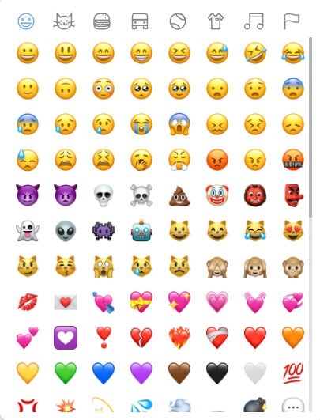

# react-emoji-virtual-list

Implemented emoji picker using virtual list, solved the problem that 'emoji-picker-react' is too slow to open

# Example

### Basic usage

```javascript

import { ReactEmojiVirtualList } from 'react-emoji-virtual-list'

<ReactEmojiVirtualList selectCallback={(emoji, item)=>{console.log("emoji", emoji)}} />

```

### demo

;